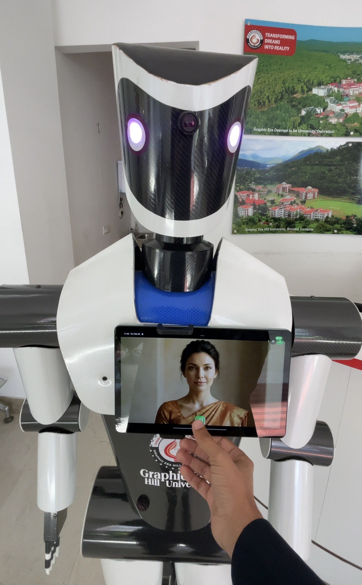
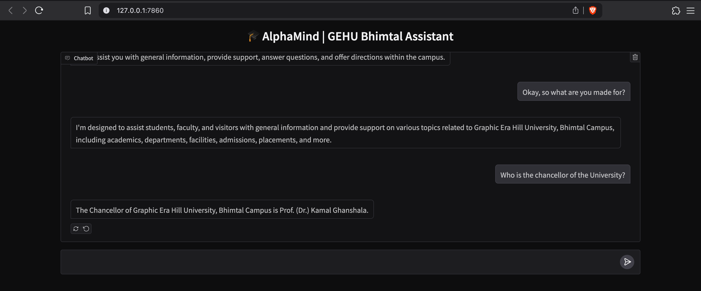

<div align="center">

# 🤖 GEHU Bhimtal AI Assistant Collection

**A suite of production-grade AI assistants built for Graphic Era Hill University, Bhimtal.**
**Developed by B.Tech CSE (AI & ML) students — Batch 2023–2027**

> This repository contains the complete documentation and source code for two major AI projects:
> 1. **Zeni** — The ultra-low-latency, real-time streaming voice AI.
> 2. **CollegeBot (AlphaMind)** — The offline-capable, RAG-powered campus assistant.

</div>

---

# 🤖 Zeni — Real-Time Bilingual Voice AI

**An ultra-low-latency voice assistant deployed as a physical AI robot receptionist**
**Built by B.Tech CSE (AI & ML) students — Graphic Era Hill University, Bhimtal (Batch 2023–2027)**

[](https://python.org)
[](https://fastapi.tiangolo.com)
[](Zeni/android/)
[](https://groq.com)
[](https://cloud.google.com)

<div align="center">
  > ~500ms first-word latency · Full-duplex streaming · Hindi + English · Robot body control · Computer vision
</div>

<div align="center">
  
  <br/>
  <sub>Zeni deployed at Graphic Era Hill University, Bhimtal Campus</sub>
</div>

---

## 🎬 Demo
<div align="center">

<video controls width="100%">
  <source src="[https://raw.githubusercontent.com/sujaljoshi19/College_Assistant_Zeni/main/Video.mp4](https://github.com/sujaljoshi19/College_Assistant_Zeni/blob/main/Video.mp4)" type="video/mp4">
</video>

<a href="[https://github.com/sujaljoshi19/College_Assistant_Zeni/blob/main/Video.mp4](https://github.com/sujaljoshi19/College_Assistant_Zeni/blob/main/Video.mp4)">▶ Watch Zeni Demo Video</a>

*Zeni talking, lip-sync animation, bilingual responses, and robot control — live at GEHU Bhimtal*

</div>

---

## 📖 What Is Zeni?

Zeni is a **production-grade, real-time bilingual voice AI assistant** built for Graphic Era Hill University. Students and visitors interact with Zeni by speaking to an Android app — within **~500 milliseconds**, Zeni begins speaking back. It handles Hindi and English seamlessly, animates a Lottie lip-sync avatar, can physically move its robot body, and sees through a camera via computer vision.

The system evolved from a basic offline LLaMA/RAG chatbot into a fully optimized streaming AI pipeline through multiple major architectural iterations. Every millisecond of latency was fought for deliberately.

---

## ✨ Features

| Feature | Details |
|---------|---------|
| ⚡ **Ultra-low latency** | ~500ms first-word latency end-to-end |
| 🎙️ **Speculative ASR** | RAG + LLM pre-warm on high-confidence partial transcripts |
| 🌐 **Bilingual** | Hindi & English auto-detection per utterance |
| 🤖 **Robot control** | LLM decides autonomously when to move (forward/back/turn) |
| 👁️ **Computer vision** | Parallel pre-analysis while user speaks → near-zero vision latency |
| 🔊 **Zero-buffer TTS** | Audio output begins with the first LLM token |
| 📚 **RAG pipeline** | ChromaDB + multilingual-e5-small for accurate college FAQ retrieval |
| ⚡ **Full-duplex** | Talk and listen simultaneously; barge-in interruption supported |
| 🎭 **Personality modes** | Assistant / Human / General — switchable live via admin panel |
| 🛡️ **Admin dashboard** | Web panel for FAQ management, real-time index rebuild, session monitoring |

---

## 🏗️ Architecture

```
Android App (Java)
     │
     │  WebSocket — binary PCM frames (33% less overhead vs Base64)
     ▼
FastAPI Server (uvicorn + uvloop)
     │
     ├─► Google Cloud ASR ──► Speculative callback (pre-warms LLM on 80%+ confidence partial)
     │                         is_final=True ──► Direct callback (no polling)
     │
     ├─► Groq LLM ──────────► llama-3.3-70b-versatile, streaming, ~200ms first token
     │    ├── RAG context injected (ChromaDB + multilingual-e5-small)
     │    ├── API key rotation (rate-limit aware, round-robin)
     │    └── Function calling: look_with_eyes | control_robot
     │
     ├─► Vision Engine ─────► Llama 4 Maverick 17B (parallel pre-analysis)
     │                         Analyzes camera frame WHILE user is still speaking
     │
     └─► Google Cloud TTS ──► streaming_synthesize, zero buffering
              │
              └─► Android ── Lottie lip-sync animation + audio playback
```

---

## 🧰 Tech Stack

| Layer | Technology |
|-------|-----------|
| **Server Framework** | FastAPI + uvicorn + uvloop |
| **LLM** | Groq Cloud — `llama-3.3-70b-versatile` |
| **ASR** | Google Cloud Speech-to-Text (bidirectional streaming) |
| **TTS** | Google Cloud Text-to-Speech (streaming synthesize) |
| **Vision** | Groq — `meta-llama/llama-4-maverick-17b-128e-instruct` |
| **RAG / Embeddings** | ChromaDB + `intfloat/multilingual-e5-small` (MPS/CUDA/CPU) |
| **Transport** | WebSocket — binary + JSON frames, full-duplex |
| **Android App** | Java/Kotlin + Lottie animation |
| **Admin Panel** | FastAPI router, token-based auth, static HTML/JS |
| **Config** | YAML + dotenv |

---

## 📋 Prerequisites

**Server:**
- Python 3.10+
- A [Google Cloud](https://cloud.google.com) project with:
  - Cloud Speech-to-Text API enabled
  - Cloud Text-to-Speech API enabled
  - A Service Account with the above roles (download JSON key)
- A [Groq](https://console.groq.com) account (free tier available)
- A [Google AI Studio](https://aistudio.google.com) API key (Gemini, for Gemini TTS)

**Android:**
- Android Studio (Hedgehog or later)
- Android device / emulator (API 26+)

---

## 🚀 Getting Started (Zeni)

### 1. Setup

```bash
cd Zeni/server

# Create and activate virtual environment
python3 -m venv venv
source venv/bin/activate       # macOS/Linux

# Install dependencies
pip install -r requirements.txt
```

### 2. Environment Configuration

```bash
# Copy the example file
cp .env.example .env

# Edit .env and fill in your real values
nano .env
```

**Required values in `.env`:**

| Variable | Description | Where to Get |
|----------|-------------|--------------|
| `GROQ_API_KEY_1` | Primary Groq API key | [console.groq.com](https://console.groq.com) |
| `GOOGLE_APPLICATION_CREDENTIALS` | Path to your GCP service account JSON | Google Cloud Console |
| `GCP_PROJECT_ID` | Your GCP project ID | Cloud Console → Project Settings |
| `ADMIN_PASSWORD` | Admin dashboard password | Choose a strong one |

### 3. Run the Server

```bash
cd Zeni/server
source venv/bin/activate
chmod +x start_zeni.sh
./start_zeni.sh
```

---

## 🧠 How the Latency Optimizations Work

The ~500ms end-to-end latency comes from deliberate engineering at every layer:

1. **Speculative ASR** → RAG search starts on 80%+ confidence *partials* before `is_final=True`
2. **Groq LLM** → ~200ms first token (10× faster than local Ollama), persistent connection pool
3. **Zero-buffer TTS** → Audio plays while LLM is still generating the rest of the sentence
4. **Binary WebSocket frames** → 33% less overhead versus Base64-encoded JSON audio
5. **Parallel vision** → Camera frame analyzed *while user is speaking* → cache hit = instant
6. **Direct callbacks** → No polling loops; `is_final` fires an immediate `asyncio.create_task`

---

# 🎓 AlphaMind — CollegeBot Assistant

**AlphaMind** is an offline, fast, campus-specific AI assistant built using **LLaMA 3.2** (via `llama.cpp` or `Ollama`), local vector search with FAISS, and a lightweight **Gradio** web app or Android app interface.

<div align="center">
  
</div>

---

## ⚙️ Features (CollegeBot)

- 🔍 **Context-aware retrieval** with FAISS and Sentence Transformers
- 💬 **Conversational memory** (short-term + long-term)
- 🧠 **Learns new facts** during chat (`remember that ...`)
- 💻 **100% offline** — no API or internet required
- 🎙️ **Voice-based input/output** for Android version
- ⚡ **Fast response time** (~1.5s) using local model tuning

---

## 🔀 Workflow

```
Startup → Language Select (hi/en)
   → Accept Voice → Translate (if needed)
     → LLaMA 3.2 (Ollama)
       → Translate Back (if Hindi)
         → TTS Speak + Lottie Avatar
```

---

## 🧪 Installation (CollegeBot Desktop)

```bash
cd CollegeBot

# Setup virtual environment
python -m venv venv
source venv/bin/activate

# Install Python dependencies
pip install -r requirements.txt

# Run the Assistant
python temp.py
```

---

## 🧠 Memory & RAG

- **Memory**: Stored in `memory.txt`, survives app restarts. Used for resolving pronouns and personal facts.
- **RAG System**: FAISS + `sentence-transformers/all-MiniLM-L6-v2`. Retrieval from structured campus data files.

---

## 📁 Project Structure (Combined)

```
College_Assistant/
├── Zeni/                    # Optimized Real-Time Voice AI
│   ├── server/              # FastAPI backend
│   ├── engines/             # ASR, LLM, TTS, & Vision engines
│   └── android/             # Android app (Java)
│
├── CollegeBot/              # Offline/RAG Assistant
│   ├── college_data/        # Knowledge base
│   ├── llama.cpp/           # Inference engine
│   └── android_app/         # Android app (Kotlin)
│
└── README.md                # This comprehensive documentation
```

---

## 🤝 Contributing

This project represents a major engineering effort by students at GEHU Bhimtal. Pull requests, issues, and suggestions are welcome!

1. Fork the repository
2. Create a feature branch
3. Commit your changes
4. Open a Pull Request

---

<div align="center">

**Built with ❤️ by B.Tech CSE (AI & ML) students**
**Graphic Era Hill University, Bhimtal — Batch 2023–2027**

</div>
